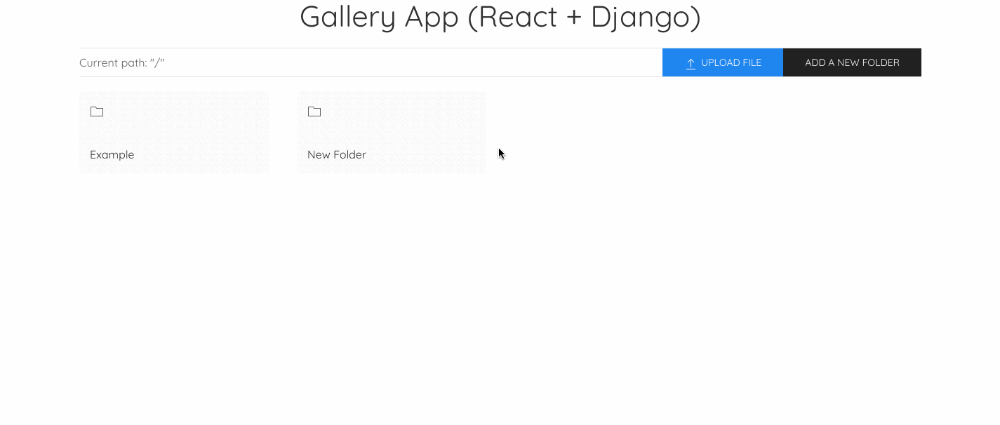

# Gallery App (React + Django)

A photo gallery web app created using React and Django Rest Framework.

## Why?
If you have an S3 storage (AWS S3, DigitalOcean Spaces, ...etc) and wish to upload photos and display them in hierarchical manner, clone the repo and run it using docker! 🚀

## Features
- View folders and photos in hierarchical manner
- Create new folders
- Upload the photos
- Delete the photos
- View image and it's details such as file name and size

## How to use

### _Backend configuration_

Add the following environment variables to the Django backend.

| Variable | Desc |
| ------ | ------ |
| SECRET_KEY | Django secret key |
| AWS_ACCESS_KEY_ID | AWS key |
| AWS_SECRET_ACCESS_KEY | AWS key |
| AWS_STORAGE_BUCKET_NAME | AWS S3 bucket name |
| AWS_S3_ENDPOINT_URL | AWS S3 bucket URL |
| AWS_S3_REGION | AWS S3 bucket region |
| AWS_S3_BUCKET_NAME | AWS S3 bucket name |
| AWS_S3_ROOT_DIRECTORY | Root directory for uploaded images (For eg: gallery/media/) |
| AWS_LOCATION | AWS S3 storage location |

### _Frontend configuration_

The following environment variables needs to be configured for the React app as well.

| Variable | Value | Desc |
| ------ | ------ | ------ |
| REACT_APP_BASE_API_URL | http://localhost:8000/ | Django API server base URL. |
| CHOKIDAR_USEPOLLING | True | Reload the app and view the changes made to the code in realtime. |

## How to run

Run the docker compose command to spin up the containers.

```
docker-compose up --build -d
```

## Demo

 